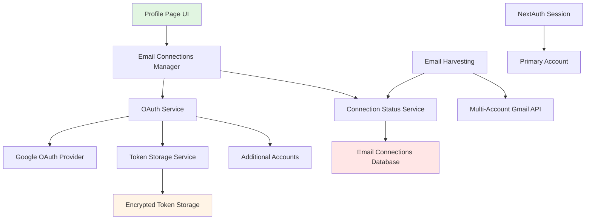

# Design Document

## Overview

The email account connections feature will extend the existing profile management system to allow users to securely connect multiple Google Gmail/Workspace accounts. The design leverages the current NextAuth Google OAuth integration while adding a multi-account connection management layer. This feature integrates with the existing user profile system, extends the backend API with new endpoints for connection management, and provides a comprehensive UI for account administration.

## Steering Document Alignment

### Technical Standards (tech.md)

The design follows the documented technical patterns:

- **FastAPI Backend Architecture**: New API endpoints follow existing patterns in `backend/users/api.py` with proper dependency injection and Pydantic schemas
- **Domain-Driven Design**: Email connections will be implemented as a separate domain module (`backend/email_connections/`) following the established pattern
- **Next.js Frontend**: React components will follow existing patterns with TypeScript, Radix UI components, and Tailwind CSS
- **OAuth2 Integration**: Extends existing Google OAuth implementation in `frontend/src/lib/auth.ts` using NextAuth patterns
- **Database Design**: Uses SQLAlchemy with async support, following the User/UserProfile relationship pattern

### Project Structure (structure.md)

The implementation will follow project organization conventions:

- **Backend Module Structure**: `email_connections/` module with models.py, schemas.py, api.py, and services.py
- **Frontend Component Organization**: Profile page components extended with new email connection management UI
- **Import Patterns**: Following established Python and TypeScript import hierarchies
- **Naming Conventions**: `snake_case` for Python, `camelCase` for TypeScript, consistent with existing codebase

## Code Reuse Analysis

### Existing Components to Leverage

- **NextAuth Configuration**: Extends existing Google OAuth setup in `auth.ts` for additional account connections
- **User Profile System**: Builds on existing UserProfile model and profile management APIs in `backend/users/`
- **Profile UI Components**: Extends `ProfileForm` component and leverages existing Card, Button, and form components
- **Database Infrastructure**: Uses existing SQLAlchemy setup, migrations, and connection patterns
- **Authentication Dependencies**: Reuses `get_current_active_user` and token management from `users/deps.py`

### Integration Points

- **Existing Auth System**: Integrates with current NextAuth JWT callback system for storing additional OAuth tokens
- **Profile Database**: Extends UserProfile table or creates related EmailConnection table linked to user profiles
- **Storage Configuration**: Uses existing storage backend abstraction for secure token storage
- **API Client Generation**: Follows existing OpenAPI generation pattern for new endpoints

## Architecture

The system implements a multi-account OAuth management layer that extends the current authentication system without disrupting existing login flows. The architecture separates concerns between account connection management and email data harvesting, allowing for independent scaling and maintenance.

### Modular Design Principles

- **Single File Responsibility**: Each component handles one aspect (connection UI, token management, OAuth flow)
- **Component Isolation**: Email connection components independent of existing auth flows
- **Service Layer Separation**: Business logic isolated in services layer, API layer handles routing only
- **Utility Modularity**: OAuth utilities, token encryption, and connection status checking in focused modules



## Components and Interfaces

### Component 1: EmailConnectionsManager (Frontend)
- **Purpose:** React component for managing multiple email account connections on profile page
- **Interfaces:** 
  - `connectAccount(): Promise<void>` - Initiates OAuth flow for new account
  - `disconnectAccount(connectionId: string): Promise<void>` - Removes account connection
  - `refreshConnection(connectionId: string): Promise<void>` - Re-authorizes expired connection
- **Dependencies:** NextAuth session, API client, OAuth service
- **Reuses:** Existing Card, Button, and form components from UI library

### Component 2: EmailConnectionService (Backend)
- **Purpose:** Business logic for managing email account connections and OAuth token lifecycle
- **Interfaces:**
  - `create_connection(user_id, oauth_data)` - Store new account connection
  - `get_user_connections(user_id)` - Retrieve all connections for user
  - `refresh_connection_token(connection_id)` - Handle token refresh
  - `revoke_connection(connection_id)` - Remove and cleanup connection
- **Dependencies:** Database session, OAuth utilities, encryption service
- **Reuses:** Existing user authentication patterns and database abstractions

### Component 3: MultiAccountOAuthFlow (Frontend/Backend)
- **Purpose:** Handles OAuth flow for additional accounts beyond primary authentication
- **Interfaces:**
  - `initiateFlow(account_type)` - Start OAuth authorization for additional account
  - `handleCallback(auth_code, state)` - Process OAuth callback and store tokens
  - `validateConnection(connection_id)` - Verify active connection status
- **Dependencies:** Google OAuth provider, session management, secure storage
- **Reuses:** Existing NextAuth Google provider configuration and callback handling

### Component 4: ConnectionStatusService (Backend)
- **Purpose:** Monitor and maintain health of email account connections
- **Interfaces:**
  - `check_connection_health(connection_id)` - Verify token validity and API access
  - `get_connection_metrics(user_id)` - Return connection statistics
  - `handle_token_expiry(connection_id)` - Manage expired token scenarios
- **Dependencies:** Google API client, token validation, database updates
- **Reuses:** Existing API error handling and logging patterns

## Data Models

### EmailConnection Model
```python
class EmailConnection(Base):
    __tablename__ = "email_connections"
    
    id = Column(Integer, primary_key=True, index=True)
    user_id = Column(Integer, ForeignKey("users.id", ondelete="CASCADE"), nullable=False)
    email_address = Column(String, nullable=False)
    provider = Column(String, default="google")
    provider_account_id = Column(String, nullable=False)  # Google account ID
    connection_name = Column(String, nullable=True)  # User-friendly name
    
    # OAuth token data (encrypted)
    access_token_encrypted = Column(Text, nullable=False)
    refresh_token_encrypted = Column(Text, nullable=True)
    token_expires_at = Column(DateTime(timezone=True), nullable=True)
    
    # Connection metadata
    scopes_granted = Column(String, nullable=False)  # JSON array of granted scopes
    connection_status = Column(String, default="active")  # active, expired, error, revoked
    last_sync_at = Column(DateTime(timezone=True), nullable=True)
    error_message = Column(String, nullable=True)
    
    created_at = Column(DateTime(timezone=True), server_default=func.now())
    updated_at = Column(DateTime(timezone=True), onupdate=func.now())
    
    # Relationships
    user = relationship("User", back_populates="email_connections")
```

### User Model Extension
```python
# Add to existing User model
class User(Base):
    # ... existing fields ...
    
    # Relationships (add this)
    email_connections = relationship("EmailConnection", back_populates="user", cascade="all, delete-orphan")
```

## Error Handling

### Error Scenarios

1. **OAuth Authorization Failed**
   - **Handling:** Catch OAuth errors, display user-friendly message, log technical details
   - **User Impact:** Clear error message with retry option and troubleshooting guidance

2. **Token Refresh Failed**
   - **Handling:** Mark connection as expired, prompt for re-authorization, maintain other connections
   - **User Impact:** Connection status indicator changes, clear instructions for reconnection

3. **Insufficient Permissions**
   - **Handling:** Detect scope limitations, prompt for re-authorization with required scopes
   - **User Impact:** Warning about limited functionality, guided re-authorization flow

4. **Network/API Errors**
   - **Handling:** Implement retry logic with exponential backoff, graceful degradation
   - **User Impact:** Temporary unavailability message, automatic retry notifications

5. **Storage Quota/Encryption Errors**
   - **Handling:** Validate before storage, fallback to secure alternatives, clean error recovery
   - **User Impact:** Clear storage limitation messages, guidance on quota management

## Testing Strategy

### Unit Testing
- OAuth flow components with mocked Google API responses
- Token encryption/decryption utilities with various data scenarios
- Connection status validation logic with edge cases
- Database model operations with SQLAlchemy test fixtures

### Integration Testing
- Complete OAuth authorization flow from UI to database storage
- Multi-account token refresh scenarios with concurrent connections
- Profile page integration with connection management components
- API endpoint testing with authentication and authorization

### End-to-End Testing
- User journey: connect multiple accounts, manage connections, use for harvesting
- Error scenarios: expired tokens, revoked access, network failures
- Cross-browser OAuth flow testing for compatibility
- Mobile responsive testing for profile page connection management