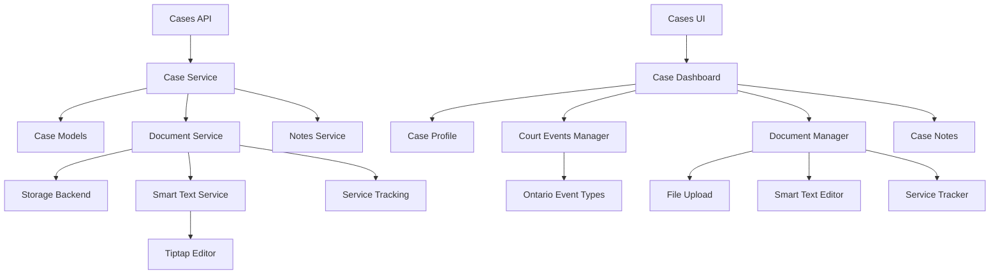

# Design Document

## Overview

The Cases app provides comprehensive Ontario family court case management through a hierarchical data structure supporting cases, case profiles, court events, dual-format document storage, document service tracking, and comprehensive case notes. The design follows the existing domain-driven architecture with separate backend modules for business logic and frontend components for user interaction, leveraging established patterns for profiles, document storage, service tracking, and smart text processing with Tiptap editor integration.

## Steering Document Alignment

### Technical Standards (tech.md)

The design adheres to the documented technical stack:
- **Backend**: FastAPI with SQLAlchemy 2.0 async models following existing domain module patterns
- **Frontend**: Next.js with TypeScript, Radix UI components, and Tailwind CSS styling
- **Storage**: Multi-backend file storage system integration for document management
- **Database**: PostgreSQL with proper indexing and ACID compliance for legal document integrity
- **Smart Text**: Tiptap editor integration for rich text storage and future ETL processing
- **Service Tracking**: Comprehensive document service lifecycle management with legal compliance

### Project Structure (structure.md)

Implementation follows established domain organization:
- **Backend Domain Module**: `/backend/cases/` with models.py, schemas.py, api.py, services.py pattern
- **Frontend Components**: `/frontend/src/components/cases/` organized by feature with reusable UI components
- **API Integration**: RESTful endpoints following `/api/v1/cases/` pattern with automatic OpenAPI documentation
- **File Organization**: Maintains existing import patterns and naming conventions

## Code Reuse Analysis

### Existing Components to Leverage

- **Storage System**: Existing multi-backend storage in `core/storages/` for document file management
- **Profile Pattern**: `contacts/models.py` Company/CompanyProfile pattern for Case/CaseProfile structure
- **Association Models**: `CompanyPersonAssociation` pattern for case event relationships
- **UI Components**: Existing form components, data tables, and list interfaces from contacts module
- **Authentication**: Current user authentication and access control systems
- **Timestamp Patterns**: Existing created_at/updated_at patterns for service tracking and case notes

### Integration Points

- **Database Models**: Extend existing SQLAlchemy base models and relationship patterns
- **File Storage**: Integration with `core/storage.py` for document upload and retrieval
- **API Layer**: Follow existing FastAPI routing and schema validation patterns
- **Frontend State**: Leverage existing API hooks and data fetching patterns
- **Search Infrastructure**: Build on existing search and filtering capabilities
- **Notification System**: Integrate with existing user notification patterns for service reminders

## Architecture

The Cases app uses a domain-driven design with clear separation between case management, court events, document storage, service tracking, case notes, and smart text processing. The architecture supports both immediate case organization needs and future intelligent document processing through dual storage formats while maintaining complete legal document service audit trails.

### Modular Design Principles

- **Single File Responsibility**: Each model file handles one entity (Case, CaseProfile, CourtEvent, Document, DocumentService, CaseNote)
- **Component Isolation**: Frontend components separated by function (case-list, case-form, event-tracker, document-manager, service-tracker, notes-editor)
- **Service Layer Separation**: Business logic in services.py, data access in models.py, API contracts in schemas.py
- **Utility Modularity**: Document processing, date formatting, service validation, and file organization utilities as focused modules



## Components and Interfaces

### Case Management Component
- **Purpose**: Core case entity with Ontario court file number validation and directory structure creation
- **Interfaces**: CRUD operations, case listing, search and filtering by court file number, case type, status
- **Dependencies**: User authentication, file system operations, case profile relationships, case notes
- **Reuses**: Existing database base models, authentication patterns, validation utilities

### Case Profile Component  
- **Purpose**: Expandable detailed case information including case history, strategy notes, key issues
- **Interfaces**: Profile creation/editing, rich text content management, visibility controls
- **Dependencies**: Case entity, smart text processing, user permissions, case notes integration
- **Reuses**: CompanyProfile pattern from contacts, existing profile UI components

### Court Events Component
- **Purpose**: Unified tracking for all Ontario family court events with event-specific metadata
- **Interfaces**: Event creation/scheduling, status tracking, chronological display, deadline management, Ontario-specific event types
- **Dependencies**: Case entity, document associations, calendar integration, service tracking
- **Reuses**: Association model patterns, existing form components, date/time utilities

### Document Storage Component
- **Purpose**: Dual-format storage with party-based organization, date-prefixed naming, and service tracking
- **Interfaces**: File upload/download, party categorization (court/respondent/applicant), metadata management, service status
- **Dependencies**: Multi-backend storage system, file validation, directory creation, service tracking
- **Reuses**: Existing storage abstraction layer, file upload components, validation patterns

### Document Service Tracking Component
- **Purpose**: Complete lifecycle tracking of document service including dates, methods, and confirmation
- **Interfaces**: Service logging, status updates, reminder notifications, service history, confirmation tracking
- **Dependencies**: Document entity, date validation, notification system, legal compliance rules
- **Reuses**: Existing timestamp patterns, notification infrastructure, validation utilities

### Case Notes Component
- **Purpose**: Comprehensive note-taking system for case strategy, events, and document annotations
- **Interfaces**: Note creation/editing, chronological display, search/filtering, event linking, rich text editing
- **Dependencies**: Case entity, court events, documents, user authentication, Tiptap editor
- **Reuses**: Existing text processing patterns, timestamp utilities, association patterns

### Smart Text Component
- **Purpose**: Tiptap editor integration for structured text content linked to original documents
- **Interfaces**: Rich text editing, document text extraction, format conversion, search indexing
- **Dependencies**: Tiptap editor, document processing utilities, metadata linking
- **Reuses**: Existing text processing patterns, editor integration approaches

## Data Models

### Case Model
```python
class Case(Base):
    id: int (primary key)
    court_file_number: str (unique, indexed, format FS-YY-NNNNN-NNNN)
    title: str (indexed)
    case_type: str (custody, access, support, property, etc.)
    court_location: str
    opposing_party: str
    status: str (active, closed, on_hold)
    user_id: int (foreign key)
    created_at: datetime
    updated_at: datetime
    
    # Relationships
    profile: CaseProfile (one-to-one)
    events: List[CourtEvent] (one-to-many)
    documents: List[CaseDocument] (one-to-many)
    notes: List[CaseNote] (one-to-many)
```

### Case Profile Model
```python
class CaseProfile(Base):
    id: int (primary key)
    case_id: int (foreign key, unique)
    case_history: text
    key_issues: text  
    opposing_counsel: json
    case_strategy: text
    important_dates: json
    settlement_discussions: text
    is_public: boolean
    created_at: datetime
    updated_at: datetime
```

### Consolidated Court Event Model
```python
class CourtEvent(Base):
    id: int (primary key)
    case_id: int (foreign key)
    
    # Ontario Family Court Event Types
    event_type: str (
        # Conferences
        case_conference, settlement_conference, trial_management_conference,
        # Motion Hearings  
        regular_motion, urgent_motion, emergency_motion,
        # Trial Events
        trial, summary_judgment_motion,
        # Specialized Hearings
        show_cause_hearing, enforcement_hearing, status_review, uncontested_hearing,
        # Administrative
        first_appearance, scheduling_conference
    )
    event_category: str (conference, motion, trial, hearing, administrative)
    
    # Common fields
    title: str
    scheduled_date: datetime
    courtroom: str
    judge: str
    status: str (scheduled, completed, adjourned, cancelled, rescheduled)
    outcome: text
    
    # Flexible metadata for event-specific fields
    event_metadata: json (
        # Examples:
        # Motion: {motion_type: "custody", urgency_level: "high", served_parties: [...]}
        # Conference: {settlement_attempts: [...], agreements: [...], next_steps: [...]}
        # Trial: {estimated_duration: "2 days", witnesses: [...], evidence_list: [...]}
    )
    
    created_at: datetime
    updated_at: datetime
    
    # Relationships
    documents: List[CaseDocument] (one-to-many, event-specific documents)
    notes: List[CaseNote] (one-to-many, event-linked notes)
```

### Document Storage Model
```python
class CaseDocument(Base):
    id: int (primary key)
    case_id: int (foreign key)
    event_id: int (nullable, for event-specific documents)
    original_filename: str
    stored_filename: str (date-prefixed: YYYY-MM-DD-filename)
    party_type: str (court, respondent, applicant)
    document_type: str (affidavit, financial_statement, correspondence, court_order, etc.)
    file_path: str
    file_size: int
    mime_type: str
    document_date: date
    smart_text_id: int (nullable, foreign key to smart text)
    uploaded_at: datetime
    
    # Relationships
    service_records: List[DocumentService] (one-to-many)
```

### Document Service Tracking Model
```python
class DocumentService(Base):
    id: int (primary key)
    document_id: int (foreign key)
    service_type: str (personal, mail, email, courier, substituted, deemed)
    service_date: date (when document was served)
    served_on: str (name of person/entity served)
    service_address: json (address where served)
    received_date: date (nullable, when receipt confirmed)
    receipt_method: str (nullable, signed receipt, email confirmation, etc.)
    service_status: str (pending, served, acknowledged, disputed, failed)
    service_notes: text
    attempts: json (array of service attempt records)
    affidavit_of_service_id: int (nullable, reference to filed affidavit)
    created_at: datetime
    updated_at: datetime
    
    # Legal compliance fields for Ontario Family Court Rules
    days_for_response: int (calculated based on service type and Ontario rules)
    response_deadline: date (calculated field)
    is_urgent: boolean
    court_ordered_service: boolean
```

### Case Notes Model
```python
class CaseNote(Base):
    id: int (primary key)
    case_id: int (foreign key)
    note_type: str (general, strategy, event, document, service, settlement)
    title: str
    content: text (supports rich text/Tiptap format)
    tiptap_content: json (nullable, Tiptap editor format)
    priority: str (low, normal, high, urgent)
    is_confidential: boolean
    
    # Linking fields
    event_id: int (nullable, link to court event)
    document_id: int (nullable, link to specific document)
    service_id: int (nullable, link to service record)
    
    # Metadata
    tags: json (array of tags for categorization)
    reminder_date: date (nullable, for follow-up reminders)
    is_completed: boolean (for action items)
    created_at: datetime
    updated_at: datetime
```

### Smart Text Model  
```python
class DocumentSmartText(Base):
    id: int (primary key)
    document_id: int (foreign key)
    tiptap_content: json (Tiptap editor format)
    plain_text: text (searchable plain text)
    extraction_method: str (manual, ocr, pdf_extract)
    confidence_score: float (for automated extractions)
    created_at: datetime
    updated_at: datetime
```

## Error Handling

### Error Scenarios

1. **Invalid Court File Number Format**
   - **Handling**: Pydantic validation with regex pattern matching for FS-YY-NNNNN-NNNN format
   - **User Impact**: Clear error message with format example and guided correction

2. **Invalid Ontario Event Type**
   - **Handling**: Validation against defined Ontario family court event types with category mapping
   - **User Impact**: Dropdown selection with Ontario-specific event types and helpful descriptions

3. **Service Date Logic Violations**
   - **Handling**: Validation ensuring service dates are not in future, receipt dates after service dates, deadline calculations per Ontario Family Court Rules
   - **User Impact**: Clear validation messages with Ontario family court rules context

4. **Event Scheduling Conflicts**
   - **Handling**: Check for scheduling conflicts within case and court availability, validation of Ontario court business days
   - **User Impact**: Conflict warnings with alternative date suggestions

5. **Document Service Compliance**
   - **Handling**: Validation of service methods against Ontario Family Court Rules, automatic deadline calculations
   - **User Impact**: Guided service method selection with compliance requirements explained

## Testing Strategy

### Unit Testing
- **Case Model Validation**: Court file number format validation, case creation with profile relationships
- **CourtEvent Model**: Ontario event type validation, metadata structure validation, status transitions
- **Service Date Calculations**: Ontario family court deadline calculations, service type validation per court rules
- **Document Storage Logic**: Date prefix generation, party categorization, filename conflict resolution  
- **Case Notes Processing**: Tiptap content validation, note linking, search indexing

### Integration Testing
- **Event Lifecycle Management**: Creating Ontario-specific court events with proper metadata and document associations
- **Service Compliance Workflow**: Complete service tracking adhering to Ontario Family Court Rules
- **Cross-Entity Linking**: Notes linking to events, documents, and service records
- **Ontario Event Sequencing**: Testing typical Ontario family court event progression (First Appearance → Case Conference → Settlement Conference → Trial)

### End-to-End Testing
- **Complete Ontario Case Workflow**: Case creation → events scheduling → document service → compliance tracking
- **Multi-Event Case Management**: Managing complex cases with multiple concurrent motions and conferences
- **Service Compliance Verification**: End-to-end testing of Ontario Family Court Rules compliance
- **Mobile Case Management**: Full Ontario-specific workflow on mobile devices