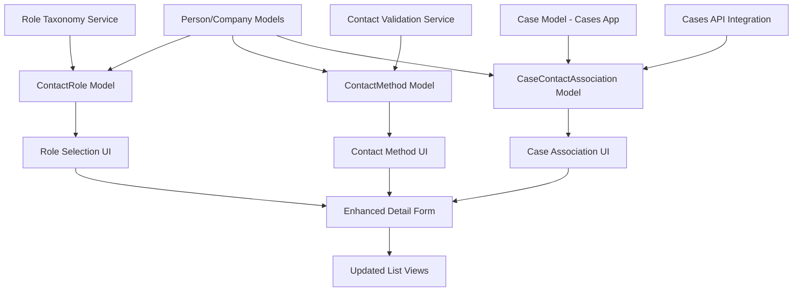

# Design Document

## Overview

The Contacts Roles and Attributes system extends the existing contacts module with legal role taxonomy, case associations, and multiple contact methods. This design builds upon the current Company/Person/Association architecture by adding role categorization, contact method management, and integration with the existing cases app while maintaining backward compatibility and following established project patterns.

The system introduces three new database models (ContactRole, ContactMethod, CaseContactAssociation) that integrate seamlessly with existing Company, Person, and Case models, providing comprehensive legal contact management capabilities for self-represented litigants.

## Steering Document Alignment

### Technical Standards (tech.md)

The design follows established FastAPI + SQLAlchemy + Next.js patterns:
- **Domain-Driven Design**: New functionality organized within existing contacts module
- **Async SQLAlchemy**: All new models use async patterns with proper relationships
- **Pydantic Schemas**: Type-safe API serialization following existing CompanyBase/PersonBase patterns
- **React Component Structure**: Modular components following existing detail-form and list patterns
- **Multi-Storage Support**: Role and contact data respects existing storage backend architecture

### Project Structure (structure.md)

Implementation follows established module organization:
- **Backend**: All new models, schemas, and APIs within `backend/contacts/` module
- **Frontend**: New components in `frontend/src/components/contacts/` following existing naming conventions
- **Database**: Extends existing PostgreSQL schema with proper foreign keys and indexes
- **API Layer**: RESTful endpoints following existing `/api/v1/contacts/` URL patterns

## Code Reuse Analysis

### Existing Components to Leverage

- **ContactBase Models**: Extend existing Company and Person models with role relationships
- **DetailForm Component**: Enhance existing detail form with role selection and contact method management
- **List Components**: Extend CompanyList and PeopleList with role filtering and visual indicators
- **Association System**: Build upon existing CompanyPersonAssociation pattern for case associations
- **CRUD Operations**: Reuse existing create/read/update/delete patterns for new entities
- **Cases App Integration**: Leverage existing Case model from cases module for contact-case relationships

### Integration Points

- **Database Schema**: New tables link to existing companies, people, and cases via foreign keys
- **API Endpoints**: Extend existing `/api/v1/contacts/` namespace with role and case endpoints
- **Cases Integration**: Link to existing `/api/v1/cases/` endpoints for case data
- **Authentication**: Use existing session management and user-scoped data access
- **Validation**: Apply existing Pydantic validation patterns to new schemas
- **UI Components**: Integrate with existing Radix UI components and Tailwind styling

## Architecture

The system uses a layered architecture that extends existing patterns while integrating with the cases app:

**Data Layer**: New SQLAlchemy models with relationships to existing Company/Person/Case tables
**Service Layer**: Business logic for role assignment, contact method validation, and case association
**API Layer**: RESTful endpoints for role management, contact methods, and case associations
**UI Layer**: React components for role selection, contact method editing, and filtered views

### Modular Design Principles

- **Single File Responsibility**: Separate files for roles, contact methods, and case associations
- **Component Isolation**: Independent components for role selection, contact method forms, and case management
- **Service Layer Separation**: Business logic isolated from API controllers and UI components
- **Utility Modularity**: Role taxonomy and validation utilities as focused modules



## Components and Interfaces

### Backend Components

#### ContactRole Model
- **Purpose:** Links contacts to legal role taxonomy with case-specific context
- **Interfaces:** Standard SQLAlchemy model with relationships to Company/Person
- **Dependencies:** Existing Company and Person models, existing Case model from cases app
- **Reuses:** Base model patterns, timestamp mixins, foreign key constraints

#### ContactMethod Model  
- **Purpose:** Stores multiple contact methods (emails/phones) with labels and priority
- **Interfaces:** CRUD operations, validation for email/phone formats
- **Dependencies:** Company and Person models for foreign key relationships
- **Reuses:** Existing validation patterns, JSON field storage for metadata

#### CaseContactAssociation Model
- **Purpose:** Links contacts to specific legal cases with role context
- **Interfaces:** Many-to-many relationship management between contacts and cases
- **Dependencies:** ContactRole and existing Case models from cases app
- **Reuses:** Association table patterns from existing CompanyPersonAssociation

#### Cases Integration Service
- **Purpose:** Service layer for integrating with existing cases app APIs
- **Interfaces:** Fetch case data, validate case associations, manage cross-module relationships
- **Dependencies:** Cases app API endpoints, authentication context
- **Reuses:** Existing API client patterns, cross-module communication

### Frontend Components

#### RoleSelector Component
- **Purpose:** Dropdown/select interface for assigning legal roles to contacts
- **Interfaces:** Props for current role, onChange handler, role taxonomy data
- **Dependencies:** Role taxonomy service, existing form components
- **Reuses:** Radix Select component, existing form styling patterns

#### ContactMethodManager Component
- **Purpose:** Dynamic form for adding/editing multiple contact methods
- **Interfaces:** Contact method array state, validation, add/remove handlers
- **Dependencies:** Contact method validation service, form utilities
- **Reuses:** Existing Input components, form validation patterns

#### CaseAssociationDialog Component
- **Purpose:** Modal for managing contact-case relationships with cases app integration
- **Interfaces:** Contact ID, case list from cases app, association management
- **Dependencies:** Cases app API integration, dialog components
- **Reuses:** Existing dialog patterns from AssociationDialog

#### EnhancedDetailForm Component
- **Purpose:** Extended version of existing detail form with role and contact method support
- **Interfaces:** Contact data with roles and methods, save handlers
- **Dependencies:** All new components plus existing DetailForm logic
- **Reuses:** Existing DetailForm as base with new sections added

## Data Models

### ContactRole Model
```python
class ContactRole(Base):
    __tablename__ = "contact_roles"
    
    id: int  # Primary key
    contact_type: str  # "company" or "person" 
    contact_id: int  # Foreign key to company or person
    role_category: str  # Primary taxonomy category
    role_subcategory: str  # Specific role within category
    custom_role: str  # User-defined role text (optional)
    is_primary: bool  # Primary role for this contact
    user_id: int  # User scope for multi-tenant support
    created_at: datetime
    updated_at: datetime
    
    # Relationships
    case_associations: List[CaseContactAssociation]
```

### ContactMethod Model
```python
class ContactMethod(Base):
    __tablename__ = "contact_methods"
    
    id: int  # Primary key
    contact_type: str  # "company" or "person"
    contact_id: int  # Foreign key to company or person
    method_type: str  # "email" or "phone"
    method_value: str  # The actual email or phone number
    label: str  # "work", "home", "mobile", etc.
    is_primary: bool  # Primary method of this type
    is_validated: bool  # Whether the method has been verified
    notes: str  # Optional notes about this contact method
    user_id: int  # User scope
    created_at: datetime
    updated_at: datetime
```

### CaseContactAssociation Model (Integration with Cases App)
```python
class CaseContactAssociation(Base):
    __tablename__ = "case_contact_associations"
    
    id: int  # Primary key
    case_id: int  # Foreign key to cases.cases table
    contact_role_id: int  # Foreign key to contact_roles
    association_start: date  # When this person joined the case
    association_end: date  # When they left (optional)
    notes: str  # Context about their involvement
    user_id: int  # User scope
    created_at: datetime
    updated_at: datetime
    
    # Relationships
    case: Case  # Relationship to existing Case model from cases app
    contact_role: ContactRole  # Relationship to contact role
```

### Updated Company Model (Extension)
```python
# Extend existing Company model with new relationships
class Company(Base):
    # ... existing fields ...
    
    # New relationships
    roles: List[ContactRole] = relationship(
        "ContactRole", 
        foreign_keys="ContactRole.contact_id",
        primaryjoin="and_(Company.id==ContactRole.contact_id, ContactRole.contact_type=='company')"
    )
    contact_methods: List[ContactMethod] = relationship(
        "ContactMethod",
        foreign_keys="ContactMethod.contact_id", 
        primaryjoin="and_(Company.id==ContactMethod.contact_id, ContactMethod.contact_type=='company')"
    )
```

### Updated Person Model (Extension)
```python
# Extend existing Person model with new relationships
class Person(Base):
    # ... existing fields ...
    
    # New relationships
    roles: List[ContactRole] = relationship(
        "ContactRole",
        foreign_keys="ContactRole.contact_id",
        primaryjoin="and_(Person.id==ContactRole.contact_id, ContactRole.contact_type=='person')"
    )
    contact_methods: List[ContactMethod] = relationship(
        "ContactMethod",
        foreign_keys="ContactMethod.contact_id",
        primaryjoin="and_(Person.id==ContactMethod.contact_id, ContactMethod.contact_type=='person')"
    )
```

## Error Handling

### Error Scenarios

1. **Invalid Role Assignment**
   - **Handling:** Validate role against taxonomy, reject invalid combinations
   - **User Impact:** Clear error message with valid role suggestions

2. **Case Integration Failures**
   - **Handling:** Graceful degradation when cases app is unavailable, cache case data
   - **User Impact:** Warning message with offline functionality for role assignment

3. **Duplicate Primary Contact Methods**
   - **Handling:** Automatically demote existing primary when new one is set
   - **User Impact:** Success message indicating primary method changed

4. **Contact Method Validation Failures**
   - **Handling:** Client-side and server-side validation with specific error messages
   - **User Impact:** Inline validation errors with format examples

5. **Case Association Conflicts**
   - **Handling:** Check for conflicting roles within same case before saving
   - **User Impact:** Warning dialog explaining conflict with resolution options

6. **Cross-Module Data Sync Issues**
   - **Handling:** Transaction management across contacts and cases modules, rollback on failure
   - **User Impact:** Clear error messages with retry options and data consistency guarantees

## Testing Strategy

### Unit Testing

**Backend Tests:**
- ContactRole model relationships and validation
- ContactMethod email/phone format validation
- Role taxonomy service logic
- Case association business rules with cases app integration
- API endpoint input validation and error responses
- Cross-module integration error handling

**Frontend Tests:**
- RoleSelector component role selection and display
- ContactMethodManager add/remove/validation logic
- CaseAssociationDialog integration with cases app
- Form validation and error display
- Role filtering and search functionality

### Integration Testing

**API Integration:**
- End-to-end role assignment and retrieval
- Contact method CRUD operations with validation
- Case association creation with cases app integration
- Role-based filtering and search functionality
- Cross-module data consistency
- Cases app API integration error scenarios

**UI Integration:**
- Complete contact creation workflow with roles and methods
- Contact editing with role changes and method updates
- Case association management with cases app integration
- List view filtering by roles and case associations
- Search functionality across all contact attributes

### End-to-End Testing

**User Scenarios:**
1. **New User Setup**: Create "My Record" contact with multiple methods and legal roles
2. **Opposition Management**: Add ex-spouse with role assignment and case association using existing cases
3. **Counsel Tracking**: Add legal representation with professional details and multiple contact methods
4. **Court Personnel**: Add judge and court staff with appropriate roles and case links to existing cases
5. **Case Organization**: Use existing cases to associate relevant contacts, filter views by case
6. **Migration Scenario**: Existing user upgrades system, assigns roles to existing contacts
7. **Cases App Integration**: Full workflow using existing cases for contact organization

**Performance Testing:**
- Contact lists with 1000+ contacts load within performance requirements
- Role filtering executes within 500ms response time
- Cases app integration responses within acceptable limits
- Search across contacts, roles, methods, and cases returns results within 1 second
- Complex contact forms with multiple methods and case associations save within 3 seconds

**Cases Integration Testing:**
- Verify proper foreign key relationships to existing Case model
- Test case deletion impact on contact associations
- Validate case filtering and association workflows
- Confirm proper user scoping across both modules