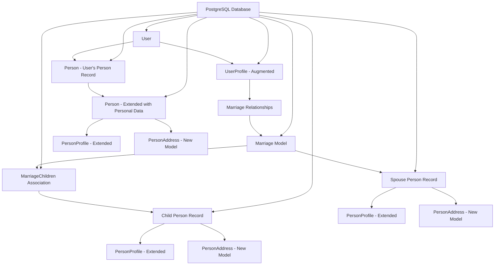

# Design Document

## Overview

This feature enhances user profile management by creating a new marriages app/package and extending existing models to support comprehensive family information. The design leverages the existing contacts/people system, augmenting Person and PersonProfile models to include personal details like date of birth, addresses, phone, and email. A new marriages domain manages multiple marriages per person with proper temporal tracking, while integrating seamlessly with the user profile system.

## Steering Document Alignment

### Technical Standards (tech.md)

**Framework Adherence**: Uses FastAPI for backend with automatic OpenAPI documentation, SQLAlchemy 2.0 for async database operations, and Next.js with TypeScript for the frontend.

**Security Implementation**: All personal information will be encrypted at rest, follows OAuth2 authentication patterns, and maintains audit trails for legal compliance.

**Database Architecture**: Extends existing PostgreSQL schema with proper foreign key relationships and follows established migration patterns using Alembic.

### Project Structure (structure.md)

**Domain Module Pattern**: Creates new `marriages` domain module following existing structure with `models.py`, `schemas.py`, `api.py`, and `services.py`.

**Model Extension**: Augments existing `contacts/models.py` Person and PersonProfile models with additional fields needed for legal proceedings.

**Component Organization**: Frontend components follow existing patterns with reusable UI components, feature-specific components, and proper separation of concerns.

## Code Reuse Analysis

### Existing Components to Leverage

- **Person/PersonProfile Models**: Extend existing models in `backend/contacts/models.py` with new personal information fields
- **UserProfile Model**: Augment with relationships to Person model and marriage information
- **Association Pattern**: Reuse CompanyPersonAssociation pattern for marriage relationships
- **Card Components**: Reuse `Card`, `CardContent`, `CardHeader` from `frontend/src/components/ui/card.tsx`
- **Form Components**: Leverage existing `Input`, `Label`, `Button` components from UI library
- **ProfileForm Pattern**: Extend `frontend/src/app/(site)/profile/_components/profile-form.tsx` structure

### Integration Points

- **User Authentication**: Integrates with existing NextAuth.js session management
- **Contacts System**: Leverages existing Person/PersonProfile infrastructure
- **Database Schema**: Extends current user and contacts tables with foreign key relationships
- **API Patterns**: Follows existing FastAPI router structure
- **Form State Management**: Uses established React hooks pattern for form management

## Architecture

The enhanced user profile system creates a marriages app that manages family relationships while extending existing Person models for comprehensive personal data. The design emphasizes data reuse, proper normalization, and legal compliance while maintaining backward compatibility.

### Modular Design Principles

- **Single Responsibility**: Marriages app handles only marriage and family relationships
- **Data Reuse**: Spouses and children are Person objects, not duplicated data
- **Service Layer Separation**: Business logic separated from data access and presentation layers
- **Utility Modularity**: Date validation, address formatting, and relationship management in focused modules



## Components and Interfaces

### Extended Person Model (Augmenting Existing)
- **Purpose:** Add personal information fields needed for legal proceedings
- **Interfaces:** New fields for date_of_birth, enhanced contact information
- **Dependencies:** Existing Person model structure
- **Reuses:** Current Person validation and relationship patterns

### New Marriages App Domain
- **Purpose:** Manages marriage relationships, temporal marriage data, and family connections
- **Interfaces:** CRUD operations for marriages, spouse relationships, children associations
- **Dependencies:** Person models, date validation utilities
- **Reuses:** Association patterns from contacts module

### PersonAddress System
- **Purpose:** Manages historical addresses for any Person (users, spouses, children)
- **Interfaces:** Address CRUD operations, address history queries, current address resolution
- **Dependencies:** Person identification, temporal data management
- **Reuses:** JSON field patterns, date handling from existing schemas

### Enhanced Profile Form
- **Purpose:** Integrates family information management into user profile workflow
- **Interfaces:** Form state management, Person creation/linking, marriage management
- **Dependencies:** Marriages API, Person management, address components
- **Reuses:** Existing ProfileForm structure, Card layouts, form patterns

## Data Models

### Extended Person Model (Augmenting Existing)
```python
class Person(Base):  # Existing model in contacts/models.py - ADD these fields:
    # ... existing fields (first_name, last_name, email, phone, etc.) ...
    
    # NEW: Personal information for legal proceedings
    date_of_birth = Column(Date, nullable=True)
    gender = Column(String(50), nullable=True)
    
    # Enhanced contact info (email/phone already exist)
    # ... existing relationships ...
    
    # NEW: Address history relationship
    addresses = relationship("PersonAddress", back_populates="person", cascade="all, delete-orphan")
```

### Extended PersonProfile Model (Augmenting Existing)
```python
class PersonProfile(Base):  # Existing model in contacts/models.py - ADD these fields:
    # ... existing fields (bio, avatar_file_id, title, location, etc.) ...
    
    # NEW: Legal proceeding specific information
    ssn_last_four = Column(String(4), nullable=True)  # Optional, encrypted
    preferred_name = Column(String(100), nullable=True)
    emergency_contact = Column(JSON, nullable=True)
```

### Augmented UserProfile Model (Extending Existing)
```python
class UserProfile(Base):  # Existing model in users/models.py - ADD these relationships:
    # ... existing fields (bio, avatar_url, storage_quota, etc.) ...
    
    # NEW: Link to Person record for family relationships
    person_id = Column(Integer, ForeignKey("people.id"), nullable=True)
    person = relationship("Person", foreign_keys=[person_id])
    
    # NEW: Direct access to marriages
    marriages = relationship("Marriage", foreign_keys="Marriage.person_id", back_populates="user_profile")
```

### PersonAddress Model (New Table)
```python
class PersonAddress(Base):
    __tablename__ = "person_addresses"
    
    id = Column(Integer, primary_key=True, index=True)
    person_id = Column(Integer, ForeignKey("people.id", ondelete="CASCADE"), nullable=False)
    
    # Address fields
    street_address = Column(String(500), nullable=False)
    city = Column(String(100), nullable=False)
    state = Column(String(50), nullable=False)
    zip_code = Column(String(20), nullable=False)
    country = Column(String(100), nullable=True, default="United States")
    
    # Temporal fields
    effective_start_date = Column(Date, nullable=False)
    effective_end_date = Column(Date, nullable=True)
    is_current = Column(Boolean, default=False)
    
    # Address type
    address_type = Column(String(50), default="residence")  # residence, mailing, work, etc.
    
    created_at = Column(DateTime(timezone=True), server_default=func.now())
    updated_at = Column(DateTime(timezone=True), onupdate=func.now())
    
    # Relationships
    person = relationship("Person", back_populates="addresses")
```

### Marriage Model (New Table in Marriages App)
```python
class Marriage(Base):
    __tablename__ = "marriages"
    
    id = Column(Integer, primary_key=True, index=True)
    
    # Marriage participants
    person_id = Column(Integer, ForeignKey("people.id", ondelete="CASCADE"), nullable=False)
    spouse_id = Column(Integer, ForeignKey("people.id", ondelete="CASCADE"), nullable=False)
    
    # Marriage timeline
    marriage_date = Column(Date, nullable=False)
    marriage_location = Column(JSON, nullable=True)  # {city, state, country}
    separation_date = Column(Date, nullable=True)
    divorce_date = Column(Date, nullable=True)
    
    # Current status (derived from dates but cached for performance)
    current_status = Column(String(50), nullable=False, default="married")  # married, separated, divorced
    
    # Legal information
    marriage_certificate_file_id = Column(Integer, nullable=True)
    divorce_decree_file_id = Column(Integer, nullable=True)
    
    created_at = Column(DateTime(timezone=True), server_default=func.now())
    updated_at = Column(DateTime(timezone=True), onupdate=func.now())
    
    # Relationships
    person = relationship("Person", foreign_keys=[person_id])
    spouse = relationship("Person", foreign_keys=[spouse_id])
    user_profile = relationship("UserProfile", back_populates="marriages", viewonly=True)
    children_associations = relationship("MarriageChildren", back_populates="marriage", cascade="all, delete-orphan")
    
    # Constraints
    __table_args__ = (
        # Prevent duplicate marriages between same people
        UniqueConstraint('person_id', 'spouse_id', 'marriage_date', name='unique_marriage'),
        # Add reverse constraint (A->B same as B->A)
        Index("ix_marriages_person_spouse", "person_id", "spouse_id"),
    )
```

### MarriageChildren Model (New Table in Marriages App)
```python
class MarriageChildren(Base):
    __tablename__ = "marriage_children"
    
    # Composite primary key
    marriage_id = Column(Integer, ForeignKey("marriages.id", ondelete="CASCADE"), primary_key=True)
    child_id = Column(Integer, ForeignKey("people.id", ondelete="CASCADE"), primary_key=True)
    
    # Custody information
    custody_status = Column(String(50), nullable=False)  # joint, sole_person, sole_spouse, other
    custody_details = Column(Text, nullable=True)
    current_living_with = Column(String(20), nullable=False)  # person, spouse, other, shared
    custody_arrangement_file_id = Column(Integer, nullable=True)
    
    created_at = Column(DateTime(timezone=True), server_default=func.now())
    updated_at = Column(DateTime(timezone=True), onupdate=func.now())
    
    # Relationships
    marriage = relationship("Marriage", back_populates="children_associations")
    child = relationship("Person", foreign_keys=[child_id])
    
    # Indexes for performance
    __table_args__ = (
        Index("ix_marriage_children_marriage_id", "marriage_id"),
        Index("ix_marriage_children_child_id", "child_id"),
    )
```

## New Marriages App Structure

### Backend Directory Structure
```
backend/
├── marriages/                 # New marriages app
│   ├── __init__.py
│   ├── models.py             # Marriage, MarriageChildren models
│   ├── schemas.py            # Pydantic schemas for marriages
│   ├── api.py                # FastAPI endpoints for marriage management
│   ├── services.py           # Business logic for marriage operations
│   └── deps.py               # Dependency injection helpers
```

### Key Services in Marriages App

- **Marriage Management**: Create, update, delete marriages with timeline validation
- **Family Tree Resolution**: Query family relationships and generate family trees
- **Children Association**: Manage parent-child relationships within marriage context
- **Custody Tracking**: Handle custody status changes and living arrangements
- **Legal Document Association**: Link marriage certificates, divorce decrees, custody orders

## Error Handling

### Error Scenarios

1. **Marriage Date Validation Errors**
   - **Handling:** Ensure marriage dates are logical (marriage before separation before divorce)
   - **User Impact:** Clear timeline validation with visual date picker constraints

2. **Person Relationship Conflicts**
   - **Handling:** Prevent circular relationships, validate marriage participants
   - **User Impact:** User-friendly messages about relationship constraints

3. **Address Date Range Conflicts**
   - **Handling:** Validate address effective dates don't overlap for current addresses
   - **User Impact:** Clear error messages with suggested date corrections

4. **Required Field Validation**
   - **Handling:** Context-aware validation (different requirements for different person types)
   - **User Impact:** Progressive disclosure of required fields based on relationship type

## Testing Strategy

### Unit Testing
- **Marriage Timeline Validation**: Test date sequence validation, status calculations
- **Person Relationship Management**: Test marriage creation, spouse linking, children associations
- **Address History Management**: Test temporal address data, current address resolution

### Integration Testing
- **Family Data Synchronization**: Test Person updates reflecting in marriage contexts
- **Profile Update Flows**: Test complete family profile updates across multiple models
- **Legal Document Association**: Test file attachments to marriage and custody records

### End-to-End Testing
- **Complete Family Profile Setup**: Test full family information collection workflow
- **Multiple Marriage Scenarios**: Test complex family structures with multiple marriages
- **Legal Document Export**: Test family data export for court document preparation

## Migration Strategy

### Database Migration Plan

1. **Extend Person and PersonProfile models**:
   - Add `date_of_birth`, `gender` to Person
   - Add legal-specific fields to PersonProfile

2. **Create PersonAddress table**:
   - Historical address tracking for all Person records

3. **Create new marriages app tables**:
   - `marriages` table with proper constraints
   - `marriage_children` association table

4. **Augment UserProfile**:
   - Add `person_id` foreign key to link users to Person records
   - Add convenience relationships to marriages

### Data Migration Strategy

- **User to Person Linking**: Create Person records for existing users
- **Address Migration**: Move any existing address data to PersonAddress model
- **Backward Compatibility**: Maintain existing API responses during transition

## Implementation Phases

### Phase 1: Model Extensions and Marriages App
- Extend Person and PersonProfile models with new fields
- Create new marriages app with Marriage and MarriageChildren models
- Create PersonAddress model for historical address tracking
- Add database migrations for all changes

### Phase 2: API Development
- Implement marriages API endpoints (CRUD operations)
- Extend Person API to handle new fields
- Create address management API with temporal queries
- Add validation for marriage timelines and relationships

### Phase 3: Frontend Integration
- Create marriage management components
- Extend existing profile form with family sections
- Implement Person creation/linking workflows
- Add address history management interface

### Phase 4: Advanced Features
- Family tree visualization
- Legal document upload and association
- Custody arrangement tracking
- Court-ready family information export

## Security and Compliance Considerations

### Data Encryption
- Personal information (SSN, sensitive details) encrypted with additional layers
- Address history maintains audit trails for legal proceedings
- Marriage and custody documents encrypted and access-controlled

### Privacy Controls
- User controls visibility of family information
- Separate permissions for different family data types
- Optional sharing with legal aid organizations or trusted persons

### Legal Compliance
- Audit trails for all family relationship changes
- Timestamped custody status changes for legal timeline documentation
- Secure export formats meeting court submission requirements
- GDPR-compliant data export and family member data deletion